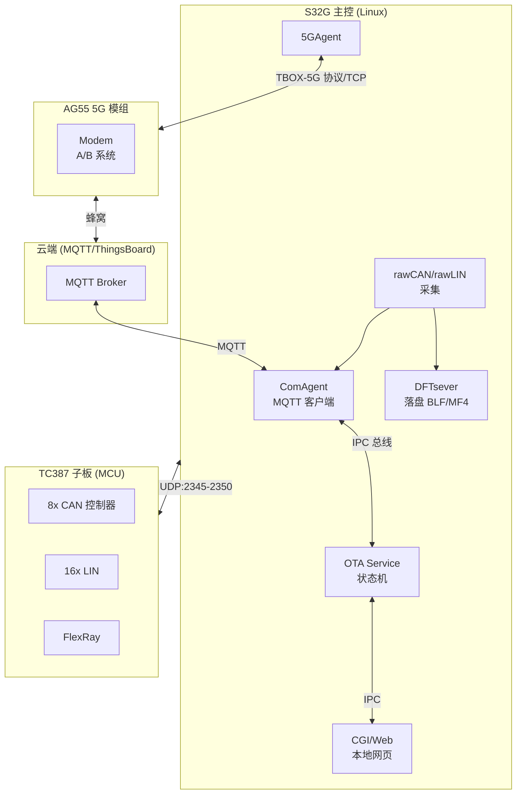
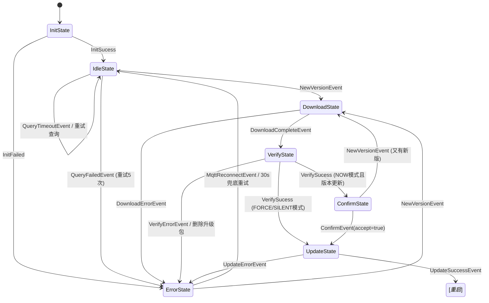
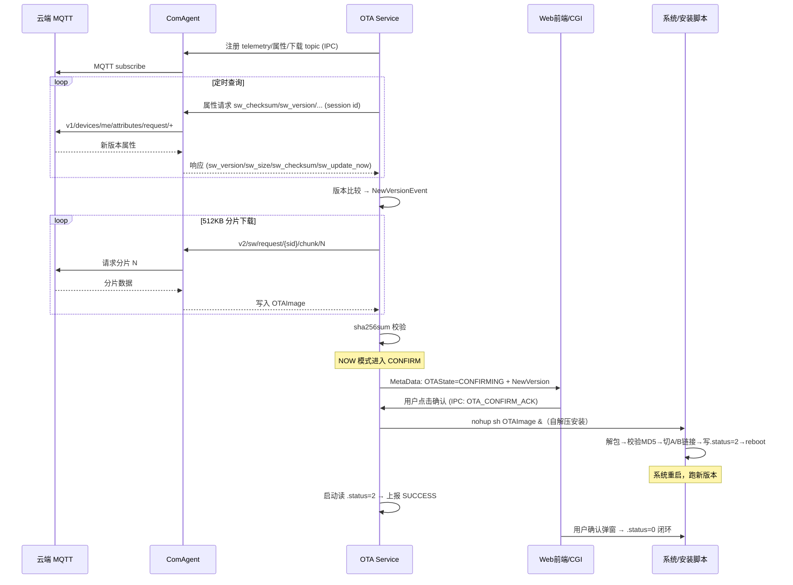
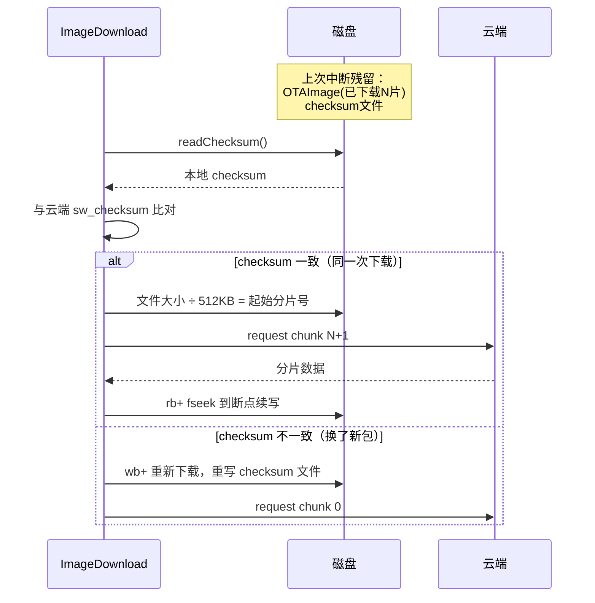
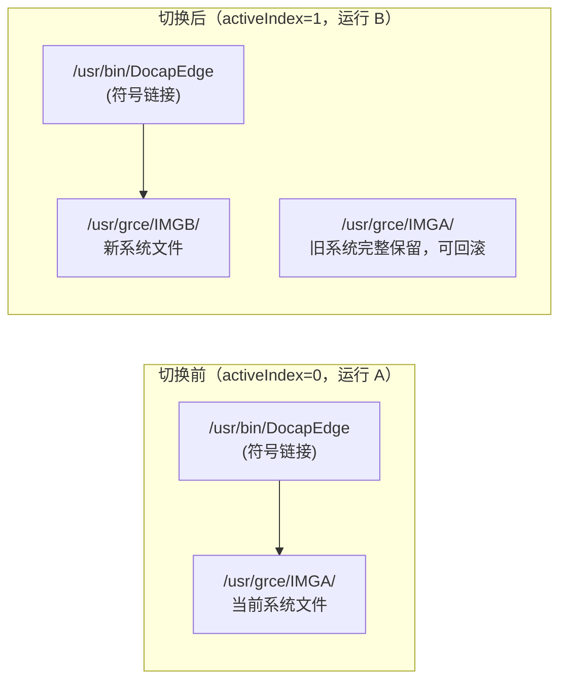
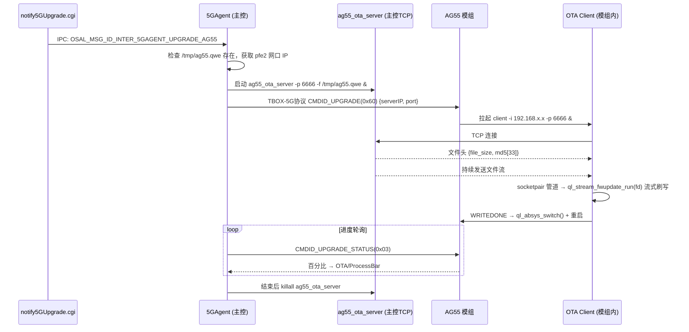
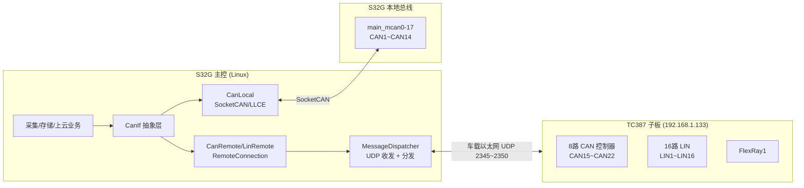
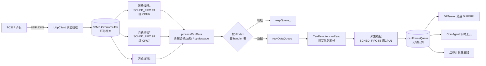

# docapEdge 项目梳理与简历素材

> 项目：车规级数据采集终端（T-BOX）嵌入式软件
> 硬件平台：NXP S32G（Linux 主控）+ 英飞凌 TC387（MCU 子板）+ 移远 AG55（5G 模组）
> 本文档整理两大核心模块：**OTA 升级系统** 与 **TC387 子板通信/CAN/LIN 数据采集**，供简历撰写与面试准备使用。
> 文中代码均节选自项目源码（路径已标注），图采用 Mermaid + ASCII，可在 Typora / VS Code / GitHub 直接渲染。

---

## 目录

- [一、项目整体概述](#一项目整体概述)
- [二、OTA 升级系统](#二ota-升级系统)
  - [2.1 总体设计](#21-总体设计)
  - [2.2 云端 OTA 状态机](#22-云端-ota-状态机)
  - [2.3 完整时序：从查询到重启确认](#23-完整时序从查询到重启确认)
  - [2.4 版本查询（MQTT 属性通道）](#24-版本查询mqtt-属性通道)
  - [2.5 分片下载与断点续传](#25-分片下载与断点续传)
  - [2.6 校验与三种升级模式](#26-校验与三种升级模式)
  - [2.7 A/B 双分区与自解压升级包](#27-ab-双分区与自解压升级包)
  - [2.8 状态上报与进度条](#28-状态上报与进度条)
  - [2.9 本地 Web 升级](#29-本地-web-升级)
  - [2.10 5G 模组 AG55 升级链路](#210-5g-模组-ag55-升级链路)
  - [2.11 TC387 子板 HEX 升级](#211-tc387-子板-hex-升级)
- [三、PREMIUM 设备与 TC387 子板通信](#三premium-设备与-tc387-子板通信)
  - [3.1 硬件架构与板型抽象](#31-硬件架构与板型抽象)
  - [3.2 通道映射表](#32-通道映射表)
  - [3.3 通信协议栈：数据面与控制面分离](#33-通信协议栈数据面与控制面分离)
  - [3.4 主控侧接收链路与性能优化](#34-主控侧接收链路与性能优化)
  - [3.5 RemoteConnection：编译期类型安全的 RPC](#35-remoteconnection编译期类型安全的-rpc)
  - [3.6 CanRemote / LinRemote：本地远程透明切换](#36-canremote--linremote本地远程透明切换)
  - [3.7 采集线程与下游消费](#37-采集线程与下游消费)
  - [3.8 双时钟域时间同步](#38-双时钟域时间同步)
- [四、简历内容](#四简历内容)
  - [4.1 项目描述（详细版）](#41-项目描述详细版)
  - [4.2 项目描述（精简版）](#42-项目描述精简版)
  - [4.3 技术栈关键词](#43-技术栈关键词)
  - [4.4 可量化指标](#44-可量化指标)
- [五、面试问答准备](#五面试问答准备)

---

## 一、项目整体概述

车规级数据采集终端（T-BOX），运行于 NXP S32G 平台（Linux），面向整车 CAN/CANFD/LIN/FlexRay/以太网数据采集、存储、上云场景。产品有多种板型（STANDARD / BASIC / PREMIUM 等），同一代码库通过板型识别（EEPROM/SN）适配不同硬件：

- **STANDARD 版**：CAN/LIN 直接挂在 S32G 本地（SocketCAN / LLCE 驱动）
- **PREMIUM 版**：S32G + TC387 双处理器架构，TC387 通过车载以太网扩展 8 路 CAN + 16 路 LIN + FlexRay
- **5G 模组**：移远 AG55，通过以太网与主控互联，负责蜂窝上行

系统采用**多进程模块化架构**：30+ 个独立进程（rawCAN、rawLIN、DFTsever 存储、ComAgent 上云、OTA、5GAgent 等），通过 Unix Domain Socket 的 IPC 消息总线（统一消息头 `OSAL_MSG_HEAD` + 模块 ID + 消息 ID）互联，元数据/配置由 MetaDataManager 集中管理。



IPC 消息统一头（`Common/common/include/env_def.h`）：

```c
typedef struct ipc_msg_head
{
    signed int src_mod_id;   // 源模块 ID，如 OSAL_MOD_ID_OTA = 10
    signed int src_msg_id;
    signed int dst_msg_id;   // 目的消息 ID，如 OSAL_MSG_ID_OTA_QUERY
} OSAL_MSG_HEAD;

typedef struct packet_pass_through
{
    OSAL_MSG_HEAD head;
    unsigned char dataid[DB_DATA_ID_LEN];
    unsigned int payload_len;
    unsigned int session_len;   // RPC topic 会话 id，追加在 payload 最后
    unsigned char payload[1];
} MQTT_PACKET_PASS_THROUGH;
```

OTA 相关消息 ID（同文件）：

```c
OSAL_MSG_ID_OTA_TELEMETRY,          // 升级相关状态信息上报
OSAL_MSG_ID_OTA_QUERY,              // 与平台交互OTA版本相关信息
OSAL_MSG_ID_OTA_SW_DOWNLOAD,        // SOTA版本分段下载
OSAL_MSG_ID_INTER_OTA_STATE_QUERY,  // 查询升级状态
OSAL_MSG_ID_INTER_OTA_CONFIRM_ACK,  // 升级确认回复
OSAL_MSG_ID_INTER_5GAGENT_UPGRADE_AG55 = 0x8200,  // 触发 5G 模组升级
```

---

## 二、OTA 升级系统

### 2.1 总体设计

OTA 系统的核心设计：**状态机驱动 + IPC 消息总线 + A/B 双分区 + 统一自解压升级包**。

- OTA Service 是独立进程，不直接连云端，通过 IPC 总线与 ComAgent（MQTT 客户端）通信——OTA 只关心状态机，网络断连/重连细节全部交给 ComAgent
- 升级包是**自解压 Shell 脚本**：脚本 + 信息分隔符 + tar 包，`sh` 执行即自动完成校验、解包、A/B 切换、重启
- 四条升级路径复用同一套包格式和分区机制：

| 升级路径 | 触发方式 | 目标 | 关键代码 |
|---|---|---|---|
| 云端 OTA | 云端下发版本属性 | S32G 主系统 | `OTA/src/statemachine/`、`OTA/src/actioner/` |
| 本地 Web 升级 | 网页手动上传 | S32G 主系统 | `CGI/src/LocalUpgrade.cpp` |
| 5G 模组升级 | CGI/云端触发 | AG55 模组 | `5GAgent/`、`5GModule/AG55_OTA_Client/` |
| TC387 子板升级 | 升级包脚本内调用 | TC387 MCU | `EdgeCore/remoteUpgrade/remoteUpdate.cpp` |

关键文件路径：

| 路径 | 说明 |
|---|---|
| `/usr/grce/OTA/upgrade/OTAImage` | 下载的升级包 |
| `/usr/grce/OTA/upgrade/checksum` | 断点续传 checksum |
| `/usr/grce/OTA/.status` | 升级状态文件（重启后回填） |
| `/usr/grce/OTA/ota_install.log` | 安装日志 |
| `/usr/grce/.reserve/activeIndex` | A/B 活动分区索引 |
| `/usr/grce/IMGA/`、`/usr/grce/IMGB/` | A/B 双分区目录 |
| `/tmp/OTAUpgrade.bin` | 本地 Web 上传的升级包 |
| `/tmp/ag55.qwe` | 5G 模组升级镜像 |

### 2.2 云端 OTA 状态机

状态与事件定义（`OTA/include/OTAState.hpp`、`OTA/src/statemachine/OTAfsm.hpp`）：

```cpp
enum class OTAState
{
    UNKNOWN, INIT, IDLE, DONWLOADING, VERIFY,
    CONFIRM, UPDATING, SUCCESS, FAILED, ERROR,
};

// 事件（tinyfsm::Event 子类）
struct InitSucess : tinyfsm::Event {};
struct NewVersionEvent : tinyfsm::Event {};
struct QueryTimeoutEvent : tinyfsm::Event {};
struct DownloadCompleteEvent : tinyfsm::Event {};
struct DownloadErrorEvent : tinyfsm::Event {};
struct VerifySucessEvent : tinyfsm::Event {};
struct VerifyErrorEvent : tinyfsm::Event {};
struct ConfirmEvent : tinyfsm::Event { bool accept; };
struct UpdateSuccessEvent : tinyfsm::Event {};
struct UpdateErrorEvent : tinyfsm::Event {};
struct MqttReconnectEvent : tinyfsm::Event {};
```

状态迁移图：



状态机核心实现（`OTA/src/statemachine/OTAfsm.cpp`）：

```cpp
void InitState::entry()
{
    actionPtr_->notifyState(OTAState::INIT);
    actionPtr_->init();
    // 升级结果回填：升级会重启系统，内存态丢失，靠 .status 文件持久化
    int status = OTAUtils::getStatus();
    if (status == OTA_RESULT::UPDATING){          // 上次升级中断
        actionPtr_->notifyState(OTAState::FAILED);
        OTAUtils::setStatus(OTA_RESULT::FAILED_B);
    }
    else if (status == OTA_RESULT::SUCCESS_A){    // 上次升级成功
        actionPtr_->notifyState(OTAState::SUCCESS);
        OTAUtils::setStatus(OTA_RESULT::SUCCESS_B);
    }
};

void IdleState::entry()
{
    actionPtr_->notifyState(OTAState::IDLE);
    actionPtr_->query();        // 向云端查询新版本
}
void IdleState::react(NewVersionEvent const &) { transit<DownloadState>(); }
void IdleState::react(QueryTimeoutEvent const &) { actionPtr_->query(); }
void IdleState::react(MqttReconnectEvent const &) { actionPtr_->query(); }

void VerifyState::react(VerifySucessEvent const &)
{
    // FORCE 模式：跳过版本检查，直接升级
    if (OTAfsm::updateNow_ == "FORCE") { transit<UpdateState>(); return; }

    bool VersionCtrl = checkUpdateVersion();
    if (OTAfsm::updateNow_ == "SILENT")           // 静默模式：不询问用户
        VersionCtrl ? transit<UpdateState>() : transit<ErrorState>();
    else                                          // NOW 模式：等用户确认
        if (VersionCtrl) transit<ConfirmState>();
}

void ConfirmState::react(ConfirmEvent const &ev)
{
    if (ev.accept == true) { updateNow_ = "FORCE"; transit<UpdateState>(); }
    else                   { actionPtr_->deferConfirm(); }
}

void ErrorState::entry()
{
    actionPtr_->notifyState(OTAState::ERROR);
    actionPtr_->notifyError(errCode_);
    // 兜底定时器: 30秒后自动重试, 防止MQTT已连接但Topic注册失败导致永远卡在ErrorState
    Singleton<CppTime::Timer>::instance().add(std::chrono::seconds(30),
        [](CppTime::timer_id) { OTAfsm::dispatch(MqttReconnectEvent{}); });
}
```

**面试要点**：重启后怎么知道上次升级成没成功？—— 升级脚本重启前往 `.status` 写 2，升级开始写 1；OTA 服务启动读这个文件回填结果。

`.status` 状态码（`OTA/UpdateTools/OTAUtils/OTAUtils.hpp`）：

```cpp
#define STATUS_FILE "/usr/grce/OTA/.status"
enum OTA_RESULT { INIT = 0, UPDATING = 1, SUCCESS_A = 2,
                  FAILED_A = 3, SUCCESS_B = 4, FAILED_B = 5 };
```

### 2.3 完整时序：从查询到重启确认



### 2.4 版本查询（MQTT 属性通道）

`OTA/src/actioner/ImageQuery.cpp`：

```cpp
// 注册属性请求/响应 topic（ThingsBoard 风格）
TopicRegInfo_t regInfo = {OSAL_MSG_ID_OTA_QUERY,
    "v1/devices/me/attributes/response/+",
    "v1/devices/me/attributes/request/+"};

// 请求体（OTA/src/common/defines.hpp）
#define OTA_REQUEST_PAYLOAD \
  "{\"sharedKeys\":\"sw_checksum,sw_update_now,sw_checksum_algorithm,sw_size,sw_title,sw_version\"}"

void ImageQuery::doQuery()
{
    m_sessid++;                                  // 递增 session id
    snprintf(sess, sizeof(sess), "%d", m_sessid);
    // payload = 请求JSON + 尾部拼接 session id（MQTT 异步响应对应用）
    pkg->session_len = strlen(sess);
    pkg->payload_len = strlen(OTA_REQUEST_PAYLOAD);
    memcpy(pkg->payload, OTA_REQUEST_PAYLOAD, pkg->payload_len);
    memcpy((pkg->payload + pkg->payload_len), sess, pkg->session_len);
    startTimer();                                // 10s 超时 → QueryTimeoutEvent
    IpcBase::instance().sendMsg(OSAL_MOD_ID_COM_AGENT, pkg, pkg_size);
}
```

响应解析与版本归一化（同文件）：

```cpp
ImageInfo::Opt_t ImageQuery::getVersionInfo(const MQTT_PACKET_PASS_THROUGH *pkg)
{
    // ... JSON parse ...
    OTAfsm::updateNow_ = rootParse["shared"]["sw_update_now"].asString(); // NOW/SILENT/FORCE
    info.checksum = checkEmpty(rootParse["shared"]["sw_checksum"].asString());
    info.size     = rootParse["shared"]["sw_size"].asUInt64();
    std::string title = checkEmpty(rootParse["shared"]["sw_title"].asString());
    setImageTitle(title, info);                   // 含 "_5G_" → 5G 固件
    info.version  = checkEmpty(rootParse["shared"]["sw_version"].asString());
    setImageVerNum(info);                         // 正则提取 + 补丁号补0
    return info;
}

void ImageQuery::setImageTitle(std::string &title, ImageInfo &imgInfo)
{
    if (title.find("_5G_") != std::string::npos)
        imgInfo.title.assign("5G");               // 区分 Edge / 5G 固件
}

// OTA/src/common/defines.hpp
#define OTA_REGEX R"((\d{1,2}\.\d{1,2}\.\d{1,2})(-\d{1,3})?)"
// 补丁号不足3位前补0：1.2.3-45 → 1.2.3-045，保证字符串可比较
```

新版本判定（`onQueryVerResp`）：与当前 Edge 版本和 5G 版本都不同才 dispatch `NewVersionEvent`：

```cpp
if (*verInfo != imgmgr.currentVersionInfo && *verInfo != imgmgr.current5GVersionInfo)
{
    RpcUtils::instance().setTopicSessionId(OSAL_MSG_ID_OTA_QUERY, id);
    imgmgr.newVersionInfo = *verInfo;
    OTAfsm::dispatch(NewVersionEvent{});
}
```

### 2.5 分片下载与断点续传

`OTA/src/actioner/ImageDownload.cpp`：

```cpp
// OTA/src/common/defines.hpp
#define OTA_CHUNK_FRAG_SIZE (512 * 1024) // 512 K

void ImageDownload::start()
{
    // 下载 topic，sessionId 继承自查询阶段
    auto sessionId = RpcUtils::instance().getTopicSessionId(OSAL_MSG_ID_OTA_QUERY);
    TopicRegInfo_t regInfo = {OSAL_MSG_ID_OTA_SW_DOWNLOAD,
        "v2/sw/response/" + std::to_string(sessionId) + "/chunk/+",
        "v2/sw/request/"  + std::to_string(sessionId) + "/chunk/+"};
    // ...注册成功后 doDownload()
}

void ImageDownload::doDownload()
{
    // 断点续传：本地 checksum 文件与云端一致 → 从已下载大小续传
    if (readChecksum() == ImageManager::instance().newVersionInfo.checksum)
    {
        uint32_t pkgSize = getPkgSize();
        m_currentChunkId = pkgSize / OTA_CHUNK_FRAG_SIZE;
    }
    if (m_currentChunkId < m_totalChunks)
        requestChunk(m_currentChunkId);
    else
        OTAfsm::dispatch(DownloadCompleteEvent{});
}

int ImageDownload::saveChunk(const char *payload, int payloadlen, const char *chunkid)
{
    ichunk = atoi(buff);
    if (ichunk != m_currentChunkId) return SUCCESS;   // 乱序包丢弃
    if (payloadlen != OTA_CHUNK_FRAG_SIZE && (m_currentChunkId + 1) != m_totalChunks)
        return FAIL;                                  // 非末包长度必须为 512KB

    if (!m_fp) {
        if (m_currentChunkId != 0) {                  // 续传：rb+ 并 fseek 到断点
            m_fp = fopen(UPDATE_RESERVE_OTA_IMAGE.c_str(), "rb+");
            fseek(m_fp, (m_currentChunkId)*OTA_CHUNK_FRAG_SIZE, SEEK_SET);
        } else {                                      // 新下载：wb+ 并写入 checksum 文件
            m_fp = fopen(UPDATE_RESERVE_OTA_IMAGE.c_str(), "wb+");
            flushChecksum();
        }
    }
    stopTimer();                                      // 收到数据，停 10s 超时
    m_retry = 0;
    fwrite(payload, payloadlen, 1, m_fp);
    m_currentChunkId++;

    if (m_currentChunkId < m_totalChunks)
        requestChunk(m_currentChunkId);               // 流水线请求下一片
    else if (m_currentChunkId == m_totalChunks)
        OTAfsm::dispatch(DownloadCompleteEvent{});
}
```

超时重试（每片 10s，3 次失败判 DOWNLOAD_FAILED）：

```cpp
void ImageDownload::startTimer()
{
    m_timerId = Singleton<CppTime::Timer>::instance().add(std::chrono::seconds(10),
        [&](CppTime::timer_id) {
            m_timerId = -1;
            m_retry++;
            if (m_retry >= 3)
                OTAfsm::dispatch(DownloadErrorEvent{});
            else
                requestChunk(m_currentChunkId);       // 重传当前分片
        });
}
```

断点续传时序：



### 2.6 校验与三种升级模式

SHA256 校验（`OTA/src/actioner/ImageParser.cpp`）：

```cpp
bool ImageParser::verify(const std::string &expectChecksum)
{
    char buff[128]{0};
    OTAUtils::run_cmd(buff, sizeof(buff), "sha256sum %s | awk '{print $1}'", m_imagePath.c_str());
    if (strcmp(buff, expectChecksum.c_str()) != 0)
        OTAfsm::dispatch(VerifyErrorEvent{});    // 校验失败 → 删除升级包 → ErrorState
    else
        OTAfsm::dispatch(VerifySucessEvent{});
}
```

版本比较（`OTAfsm.cpp`）：区分 Edge / 5G 固件

```cpp
bool VerifyState::checkUpdateVersion()
{
    ImageManager &imgMgr = ImageManager::instance();
    if ((imgMgr.newVersionInfo.title == "Edge" &&
         imgMgr.newVersionInfo.verNum > imgMgr.currentVersionInfo.verNum) ||
        (imgMgr.newVersionInfo.title == "5G" &&
         imgMgr.newVersionInfo.verNum > imgMgr.current5GVersionInfo.verNum))
        return true;
    return false;   // 旧版本不升级
}
```

三种升级模式与执行（`OTA/src/actioner/ImageUpdate.cpp`）：

```cpp
int ImageUpdate::update()
{
    prepareForUpdate();   // chmod +x OTAImage
    if (OTAfsm::updateNow_ == "FORCE")
        updateWithReboot();       // 立即升级并重启
    else if (OTAfsm::updateNow_ == "SILENT")
        updateWithoutReboot();    // 升级后下次重启生效
}

void ImageUpdate::updateWithReboot()
{
    std::string cmd_update = "nohup sh " + UPDATE_RESERVE_OTA_IMAGE +
                             " > /usr/grce/OTA/ota_install.log 2>&1 &";
    daemon_execmd(cmd_update.c_str());   // 经 DocapDaemon 执行
}

void ImageUpdate::updateWithoutReboot()
{
    std::string cmd_update = "EFFECT_AFTER_REBOOT=1 " + UPDATE_RESERVE_OTA_IMAGE +
                             " > /usr/grce/OTA/ota_install.log 2>&1 &";
    daemon_execmd(cmd_update.c_str());
}
```

| 模式（sw_update_now） | 版本检查 | 用户确认 | 生效方式 |
|---|---|---|---|
| `NOW`（默认） | 需要 | 需要（CONFIRM 状态） | 确认后按 FORCE 执行，立即重启 |
| `SILENT` | 需要 | 不需要 | `EFFECT_AFTER_REBOOT=1`，下次重启生效 |
| `FORCE` | 跳过 | 不需要 | 立即执行安装脚本并重启 |

### 2.7 A/B 双分区与自解压升级包

**自解压包结构**（`OTA/UpdateTools/docapEdgeHeader.sh`）：

```
┌─────────────────────────────────────┐
│  Shell 安装脚本（本文件前半部分）      │
├─────────────────────────────────────┤
│  END_OF_SCRIPT_START_OF_INFO        │  ← 脚本/信息分隔符
│  Md5Value: <hex>                    │
│  ProjectRev: ...                    │  ← 版本信息
│  ProjectName: ...                   │
├─────────────────────────────────────┤
│  END_OF_INFO_START_OF_PACKAGE       │  ← 信息/包分隔符
│  UpdatePackage.tar (二进制)          │
└─────────────────────────────────────┘
```

安装脚本核心流程（`do_upgrade`，节选）：

```bash
# 1. 提取并校验 MD5
do_extract() {
    delimiter_line=$(awk -v delimiter="$INFO_PACKAGE_DELIMITER" \
        '$0 ~ "^" delimiter {print NR}' "$script_file")
    tail -n +$((delimiter_line+1)) "$script_file" > $extracted_zip
    md5val_=$(md5sum "$extracted_zip" | awk '{print $1}')
    if [[ "$md5val_" != "$md5val" ]]; then
        run_error_log "md5 value is wrong, extract Failed!"; exit 1
    fi
}

# 2. 升级主流程
do_upgrade() {
    flush_Status 1                              # .status = 1（升级中）
    tar -zxvf "$TEMP_ORIGIN_FILE" -C "$TEMP_UNZIP_DIR" | 解包并刷进度条

    # 3. 读 activeIndex，决定装到 A 还是 B
    if [ "$ACTIVE_INDEX" -eq 1 ]; then
        ACTIVE_INDEX=0; pNowImgDir="$IMG_DOCAPEDGE_B_DIR"; pNewImgDir="$IMG_DOCAPEDGE_A_DIR"
    else
        ACTIVE_INDEX=1; pNowImgDir="$IMG_DOCAPEDGE_A_DIR"; pNewImgDir="$IMG_DOCAPEDGE_B_DIR"
    fi

    # 4. 创建符号链接切换分区
    if $TEMP_UNZIP_DIR/opt/create_image_link.sh "$TEMP_UNZIP_DIR" "$pNewImgDir" "$pNowImgDir"; then
        if [ -n "$EFFECT_AFTER_REBOOT" ]; then
            flush_Status 2                      # 下次重启生效
        else
            do_upgrade_tc387                    # 顺带升级 TC387 固件
            flush_Status 2                      # .status = 2（成功待确认）
            reboot                              # 立即重启
        fi
    fi
}
```

**A/B 分区切换原理**（`create_image_link.sh`）：系统运行的文件实际是符号链接，"切换分区"就是改链接指向 + 写 activeIndex，原子且可回滚：

```bash
create_link() {
    cd ${NEWDIR}
    upfiles=$(find . ! -type d)
    for upfile in ${upfiles}; do
        upfile=${upfile#*/}
        if [ -e "/${upfile}" ]; then
            if [ ! -L "/${upfile}" ]; then
                mv_file "/${upfile}" "${OLDDIR}"      # 旧实体文件备份到旧分区
            fi
        fi
        if [ -L "./${upfile}" ]; then
            cp_file "./${upfile}" "/"                 # 链接原样复制
        else
            ln_file "/${upfile}" "${NEWDIR}/${upfile}" # 创建指向新分区的链接
        fi
    done
    sync
}
```



### 2.8 状态上报与进度条

每次状态迁移双路通知（`OTA/src/statemachine/stateAction.cpp`）：

```cpp
bool StateActionImpl::notifyState(OTAState state)
{
    notifyCloud(toStr(state));   // MQTT telemetry 上报云端
    notifyLocal(toStr(state));   // 写 MetaData 供本地前端
}

void StateActionImpl::notifyCloud(const std::string &state)
{
    root["current_sw_title"]   = ImageManager::instance().newVersionInfo.title;
    root["current_sw_version"] = ImageManager::instance().currentVersionInfo.version;
    root["sw_state"]           = state;             // INITIATED/DOWNLOADING/...
    root["sw_timestamp"]       = seconds;
    root["serial_number"]      = string(SerialNumber);
    // → v1/devices/me/telemetry
}

void StateActionImpl::notifyLocal(const std::string &status)
{
    metadata_set_state("OTA", "OTAState", status.c_str());
    if(status=="CONFIRMING")
        metadata_set_state("OTA","NewVersion", ...);
    // OTA 状态映射为升级进度，供前端 Upgradefile.cgi 轮询
    static const std::map<std::string, std::string> stateToProgress = {
        {"INITIATED", "0"},   {"IDLE", "0"},        {"CONFIRMING", "0"},
        {"DOWNLOADING", "20"},{"VERIFYING", "50"},  {"UPDATING", "80"},
        {"SUCCESS", "100"},
    };
}
```

### 2.9 本地 Web 升级

云端 OTA 的"手动版"（`CGI/src/LocalUpgrade.cpp`）：用户网页上传**同一格式**的自解压包，存到 `/tmp/OTAUpgrade.bin` 后直接后台执行，后续流程完全一致。

```cpp
metadata_set_state("OTA", "Freeze", "True");          // 冻结配置防干扰
const_file_iterator file = formData.getFile("userfile");
std::ofstream outputFile("/tmp/OTAUpgrade.bin", std::ios::binary);
file->writeToStream(outputFile);
// ...
metadata_set_state("OTA", "ProcessBar", "0");
system(("chmod +x " + FILEPATH).c_str());
system((FILEPATH + " > /usr/grce/OTA/ota_install.log 2>&1 &").c_str());
```

配套 CGI：

- `Upgradefile.cgi`：返回 `OTA/ProcessBar` 进度数值给前端轮询
- `ConfirmUpdate.cgi`：用户点击确认 → 发 `OSAL_MSG_ID_INTER_OTA_CONFIRM_ACK` IPC；带 `StatusClear` 参数则将 `.status` 重置为 0

### 2.10 5G 模组 AG55 升级链路

跨三个进程、两块处理器的升级路径：



主控侧（`5GAgent/src/5GAgent.cpp`）：

```cpp
int upgrade_ag55_module(void)
{
    metadata_set_state("OTA", "ProcessBar", "1");
    // 检查镜像与 server 程序
    if (access(AG55_IMAGE_PATH, F_OK) != 0)        // /tmp/ag55.qwe
        return ERROR_OTHER;
    if (access(AG55_OTA_SERVER_PATH, F_OK) != 0)   // /usr/bin/ag55_ota_server
        return ERROR_OTHER;

    // 获取与模组互联的网口 IP（pfe2）
    strncpy(ifr.ifr_name, AG55_CONNECT_IFNAME, IF_NAMESIZE);
    ioctl(fd, SIOCGIFADDR, &ifr);

    // 读取 OTA 端口（默认 6666），启动 TCP 文件服务器
    metadata_get("Agent5G", "AG55OTAServerPort", cmdbuf, sizeof(cmdbuf));
    otaPort = atoi(cmdbuf);
    snprintf(cmdbuf, sizeof(cmdbuf), "%s -p %d -f %s &",
             AG55_OTA_SERVER_PATH, otaPort, AG55_IMAGE_PATH);
    system(cmdbuf);

    // 通过 TBOX-5G 协议通知模组来拉取
    CSocketClient::GetInstance()->send_cmd60_upgrade(
        ((struct sockaddr_in *)(&ifr.ifr_addr))->sin_addr.s_addr, otaPort);
}
```

模组侧流式刷写（`5GModule/AG55_OTA_Client/src/client.c` + `ota_over_net.c`）：

```c
// ota_proc：socketpair 管道的接收端直接喂给移远刷写 API
void *ota_proc(void *param)
{
    int fd = (int)param;
    saveStateToFile(OTA_PARTITION);
    g_ota_state = OTA_NET_STATE_UPDATE;
    ret = ql_stream_fwupdate_run(fd);          // 流式写入非活动分区
    if (ret == ERR_INVAILED_PACKAGE) { saveStateToFile(INVAILED_PACKAGE); ... }
    else                             { g_ota_state = OTA_NET_STATE_FINISH; }
}

// 主流程：边收边刷
while (1) {
    recv_len = recv(fd, buf, sizeof(buf), 0);
    ota_net_write(buf, recv_len);              // 写入 socketpair → 刷写线程
    size += recv_len;
    if (size == info.file_size) break;
}

// 刷完后查状态机
ret = test_ql_absys_getstatus();
if (WRITEDONE == ret) {
    saveStateToFile(REBOOT_NOW);
    test_ql_absys_switch();                    // 切分区 + sys_reboot
} else if (FAILED == ret) {
    test_ql_absys_sync();                      // 同步回滚
}
```

模组升级状态码（`ota_over_net.h`）：`LINKING_OTA_SERVER=1`、`OTA_FILE_DOWNLOAD=2`、`OTA_PARTITION=3`、`REBOOT_NOW=4`、`BACK_UP=5`、`LINKING_ERROR=101`、`READ_DATA_ERROR=102`、`INVAILED_PACKAGE=103`、`OTA_FAILED=255`、`OTA_SUCCEED=256`，写入 `/usrdata/grce/ag55_upgrade.status`。

进度回传（`CSocketClient::parse_cmd03_upgradestatus`）：

```cpp
int CSocketClient::parse_cmd03_upgradestatus(unsigned char *data, int *datalen, int buflen)
{
    TBOX5G_03_UPSTATUS *psCmd03 = (TBOX5G_03_UPSTATUS *)data;
    int iStatus = ntohl(psCmd03->status);
    // 进度映射：256 → 100，其余 status × 18
    metadata_set_format("OTA", "ProcessBar", "%d", iStatus == 256 ? 100 : iStatus * 18);
    // 顺带回读模组版本信息写入 MetaData
    metadata_set("DeviceInfo", "CommProjectRev", psCmd03->proj);
    if (iStatus > 100 || iStatus == 0) {         // 结束
        system(AG55_EXIT_OTA_SERVER);            // killall + 删镜像
        g_bUpStatus = false;
    }
}
```

### 2.11 TC387 子板 HEX 升级

通过以太网对 TC387 子板刷 Intel HEX 固件（`EdgeCore/remoteUpgrade/remoteUpdate.cpp`），协议定义（`EdgeCore/remoteCapture/protocol/include/upgrade_message.h`）：

```c
typedef struct { uint8_t reserved; } Ota_Req_t;
typedef struct { uint8_t error; char version[64]; } Ota_Version_Resp_t;
typedef struct { uint8_t error; uint8_t isReady; } Ota_Upgrade_Resp_t;
typedef struct { bool reserved; } Ota_Upgrade_Erase_Suc_t;      // 擦除完成通知

typedef struct {
    Ota_Transfer_Data_t data;    /* Block: size + bytes[32] */
    uint32_t address;            /* 目标 Flash 地址 */
    uint32_t seqNum;             /* 块序号 */
} Ota_Transfer_Data_Req_t;

typedef struct {
    uint32_t totalSeqNum;
    Ota_Transfer_End_Md5_t md5;  /* 整包 MD5 */
} Ota_Transfer_End_Req_t;
typedef struct { uint8_t error; bool md5Match; } Ota_Transfer_End_Resp_t;
```

升级主流程（`remoteUpdate.cpp`）：

```cpp
int RemoteUpdate::start()
{
    std::string updateVersion = getUpgradeVersion();   // HEX 第一行 = 版本号（约定）
    std::string remoteVersion = getRemoteVersion();    // 问子板当前版本
    if (updateVersion == remoteVersion) return 0;      // 版本相同不升

    uint8_t upgradeStatus = getUpgradeStatus();        // isReady == 1 ?
    if (upgradeStatus != 1) return -1;
    if (!waitForFlashErase()) return -1;               // 等子板擦除完成（60s）
    if (!sendFile()) return -1;                        // 逐块发送 + MD5
    std::this_thread::sleep_for(std::chrono::seconds(5));
    if (!resetDevice()) return -1;                     // 复位子板
    if (!getInterfaceOperstate()) return -1;           // 等子板网口恢复（enu1u4）
    if (!waitForConnection()) return -1;               // 重新建链

    remoteVersion = getRemoteVersion();                // 最终版本验证
    return (updateVersion == remoteVersion) ? 0 : -1;
}
```

Intel HEX 逐行解析与逐块确认发送：

```cpp
bool RemoteUpdate::sendHexFile(std::ifstream &file, uint32_t &seqNum, EVP_MD_CTX *mdctx)
{
    while (std::getline(file, line))
    {
        if (line.empty() || line[0] != ':') continue;
        if (isFirstLine) { isFirstLine = false; continue; }   // 跳过版本行

        int len  = std::stoi(line.substr(1, 2), nullptr, 16);
        int addr = std::stoi(line.substr(3, 4), nullptr, 16);
        int type = std::stoi(line.substr(7, 2), nullptr, 16);
        // ... 每行 checksum 校验 ...

        if (type == 0x04) {                          // 扩展线性地址
            uint32_t tmp = std::stoi(line.substr(9, 4), nullptr, 16);
            if ((tmp & 0xFF00) == 0x8000)            // 高8位 0x80 → 替换 0xA0
                tmp = (tmp & 0x00FF) | 0xA000;
            baseAddr = tmp << 16;
        }
        else if (type == 0x00) {                     // 数据记录
            uint32_t fullAddr = baseAddr + addr + FIX_OFFSET_ADDRESS;  // +0x600000
            EVP_DigestUpdate(mdctx, data.data(), data.size());         // 累积 MD5

            OTA_TRANSFER_DATA_REQ_t req = OTA_TRANSFER_DATA_REQ_t_init_default;
            req.seqNum = seqNum++;
            req.address = fullAddr;
            req.data.size = len;
            memcpy(req.data.bytes, data.data(), len);
            auto resp = m_connection->request(req);  // 每块都等子板确认
            if (!resp || (*resp).error != MessageError_t_RCM_ERROR_NONE)
                return false;
        }
        else if (type == 0x01) break;                // 文件结束
    }
}
```

结尾 MD5 校验：

```cpp
bool RemoteUpdate::sendEndRequest(uint32_t totalSeqNum)
{
    OTA_TRANSFER_END_REQ_t endReq = OTA_TRANSFER_END_REQ_t_init_default;
    endReq.totalSeqNum = totalSeqNum;
    memcpy(endReq.md5.bytes, md5bin.data(), md5len);
    auto endResp = m_connection->request(endReq);
    if (!(*endResp).md5Match) { /* MD5 不匹配，传输失败 */ return false; }
    return true;
}
```

---

## 三、PREMIUM 设备与 TC387 子板通信

### 3.1 硬件架构与板型抽象

PREMIUM 版是双处理器架构：S32G 运行 Linux 应用，TC387 MCU 子板扩展 8 路 CAN + 16 路 LIN + FlexRay，两板通过车载以太网互联，**子板固定 IP `192.168.1.133`**。



板型识别（`Common/common/include/device_type.h`）：

```cpp
enum DEV_TYPE_BITS
{
    DEVTYPE_STANDARD_BIT = 0x01,
    DEVTYPE_BASIC_BIT    = 0x02,
    DEVTYPE_PREMIUM_BIT  = 0x04,   // PREMIUM 版
    DEVTYPE_STANDARD_B3_BIT = 0x08,
    DEVTYPE_BASIC_COSTDOWN_BIT = 0x10,
};
DEVICE_TYPE getDeviceType();   // 运行时从 EEPROM/SN 识别
```

各模块通过 `getDevTypeUse()` 声明支持的板型，例如：

```cpp
uint16_t TimeSync::getDevTypeUse() { return DEVTYPE_PREMIUM_BIT; }  // 仅 PREMIUM
uint16_t Flexray::getDevTypeUse()  { return DEVTYPE_PREMIUM_BIT; }
uint16_t C5GAgent::getDevTypeUse() { return DEVTYPE_STANDARD_ALL_BITS | DEVTYPE_PREMIUM_BIT; }
```

### 3.2 通道映射表

核心抽象：**上层业务不关心某路 CAN 是本机的还是 TC387 的**。

映射表结构（`Common/common/include/logicCanMap.h`）：

```cpp
typedef enum { INTERFACE_LOCAL = 0, INTERFACE_REMOTE } INTERFACE_TYPE;

enum class RemoteInterfaceIndex
{
    CAN0, CAN1, ..., CAN15,       // 远端 CAN 通道
    LIN0, LIN1, ..., LIN15,       // 远端 LIN 通道
    FLEXRAY0, ..., FLEXRAY4,
    IF_SYSTEM = 0xff, MAX,
};

typedef struct logicMapType_tag
{
    uint8_t chlIdx;               // 通道编号
    string phyName;               // 物理接口名（main_mcan0 / remotecan0 / lin0）
    string logicName;             // 逻辑名（CAN1 / CAN15 / LIN1）
    uint8_t trcvType;             // 收发器类型（TJA1043/TJA1145）
    INTERFACE_TYPE interfaceType; // 本地 or 远程
    RemoteInterfaceIndex remoteIfIndex;  // 远端接口索引
} logicMapType_ST;
```

PREMIUM 板型的映射（`Common/common/src/logicCanMap.cpp:114`）：

```cpp
logicMapType_ST premiumLogicMapping[] = {
    // CAN1~CAN14：S32G 本地（main_mcanX / mcu_mcanX）
    {0x00, "main_mcan0",  "CAN1",  CANTRCV_DEV_1145, ..., INTERFACE_LOCAL,  RemoteInterfaceIndex::MAX},
    {0x01, "main_mcan1",  "CAN2",  CANTRCV_DEV_1145, ..., INTERFACE_LOCAL,  RemoteInterfaceIndex::MAX},
    {0x02, "mcu_mcan0",   "CAN3",  CANTRCV_DEV_1043, ..., INTERFACE_LOCAL,  RemoteInterfaceIndex::MAX},
    // ... CAN4~CAN14 同理 ...
    // CAN15~CAN22：TC387 子板（INTERFACE_REMOTE）
    {0x0e, "remotecan0",  "CAN15", ..., INTERFACE_REMOTE, RemoteInterfaceIndex::CAN0},
    {0x0f, "remotecan1",  "CAN16", ..., INTERFACE_REMOTE, RemoteInterfaceIndex::CAN1},
    // ... CAN17~CAN22 → CAN2~CAN7 ...
    // LIN1~LIN16：全部走 TC387
    {LIN_CHLID_TO_GLOBAL_CHLID(0), "lin0", "LIN1", ..., INTERFACE_REMOTE, RemoteInterfaceIndex::LIN0},
    // ... LIN2~LIN16 → LIN1~LIN15 ...
    // FlexRay1：TC387
    {FLEXRAY_CHLID_TO_GLOBAL_CHLID(1), "flexray1", "FlexRay1", ..., INTERFACE_REMOTE, RemoteInterfaceIndex::FLEXRAY0},
};
```

**面试要点**：同一套采集/存储/上传代码不改一行，同时跑在单板 SocketCAN 和双板远程 CAN 上——差异被这一张映射表 + 工厂吸收了。

### 3.3 通信协议栈：数据面与控制面分离

#### 端口分配

| 端口 | 业务 | 报文结构 |
|---|---|---|
| 2345 | CAN 数据/配置 | `CAN_UDP_t` |
| 2346 | LIN 数据/配置 | `LIN_UDP_t` |
| 2347 | FlexRay | - |
| 2348 | 时间同步 | `TimeSync_t` |
| 2349 | OTA 升级 | `OTA_UDP_t` |
| 2350 | 风扇/温度 | `Temp_UDP_t` |

#### 数据面（子板 → 主控，高频）：UDP 定长聚合帧

CAN 聚合帧（`EdgeCore/remoteCapture/protocol/include/rcp_message.h`）：

```c
typedef struct __attribute__((packed)) {
    uint8_t flag;        // CAN_FRAME_DATA / CAN_FRAME_CONTROL /
                         // CAN_CONFIG_RESPONSE / CAN_SLEEP
    uint8_t bitmap;      // 哪些通道有数据（bit N = 通道 N）
    uint16_t pad;
    uint32_t udpCount;   // UDP 递增序号 → 丢帧检测
    union {
        CAN_UDP_Frame_t   frame[CAN_CHANNEL_NUM];     // 8 通道数据帧
        CanConfigUDP_t    ctl[CAN_CHANNEL_NUM];       // 控制帧
        Config_Response_t response[CAN_CHANNEL_NUM];  // 配置响应
    };
} CAN_UDP_t;

typedef struct __attribute__((packed)) {
    uint8_t ch;              // 通道号
    uint8_t fd;              // IfxCan_FrameMode：标准帧/FD长帧/FD长+快帧
    uint8_t dlc;             // IfxCan_DataLengthCode：0~64
    uint8_t pad;
    uint32_t messageId;      // CAN ID
    uint8_t data[64];        // 最大 CANFD 64 字节
} CAN_UDP_Frame_t;
```

ASCII 报文布局：

```
CAN_UDP_t（定长，一次 memcpy 解析）
┌─────────┬─────────┬─────────┬────────────┬──────────────────────────────┐
│ flag(1) │bitmap(1)│ pad(2)  │udpCount(4) │ frame[0] ... frame[7]        │
│ 帧类型   │通道位图  │         │ UDP序号     │ 每通道 76B: ch/fd/dlc/id/data│
└─────────┴─────────┴─────────┴────────────┴──────────────────────────────┘
  bitmap & (1<<ch) != 0 → 该通道帧有效
```

LIN 聚合帧（同文件，16 通道）：

```c
typedef struct __attribute__((packed)) {
	uint8_t channel;
    uint8_t pid;
    uint8_t dir;         // Master发头/发头+响应/收响应，Slave发响应/收响应
    uint8_t dl;
    uint8_t data[8];
} LIN_UDP_Frame_t;

typedef struct __attribute__((packed)) {
    uint8_t cmd;         // MODE_CONFIG / ADD_SCHEDULE / DEL_SCHEDULE
    uint8_t open;
    uint8_t lin_mode;    // LinMode_Master / LinMode_Slave
    uint8_t schedule_flag;
    uint32_t response_timeout;
    uint32_t bitrate;
    uint32_t checksumMode;  // 经典校验 / 增强校验
} LIN_UDP_Config_t;
```

**设计动机**：CAN 满负载帧率极高，一报文一 UDP 包会压垮协议栈；**8 通道聚合成一个定长包，解析就是一次 memcpy，零序列化开销**。

#### 控制面（主控 ↔ 子板，低频）：nanopb/Protobuf 请求-响应

`EdgeCore/remoteCapture/protocol/proto/rcp_message.proto`：

```protobuf
message RcpMessage {
    uint32 version = 1[(nanopb).int_size = IS_8];
    uint32 deviceId = 2[(nanopb).int_size = IS_8];
    uint32 sequenceCounter = 3[(nanopb).int_size = IS_16];
    uint64 timestamp = 4;
    uint32 flag = 5;        // DATA / REQUEST / RESPONSE / HISTORY
    uint32 ifIndex = 6;     // 通道索引（RemoteInterfaceIndex）

    oneof payload {
        CanFrame_t can_frame = 9;
        CanfdFrame_t canfd_frame = 10;
        CanConfig_t can_config = 11;
        CanConfigResp_t can_config_resp = 12;
        LinFrame_t lin_frame = 13;
        LinConfigScheduleTable_t lin_schedule_table = 14;
        LinConfig_t lin_config = 16;
        HeartBeat_t heart_beat = 18;
        TimeSync_t time_sync = 20;
        flexrayFrame_t flexray_frame = 22;
        versionReq_t version_req = 29;
        OTA_UPGRADE_REQ_t ota_upgrade_req = 31;
        OTA_TRANSFER_DATA_REQ_t ota_transfer_data_req = 34;
        OTA_TRANSFER_END_REQ_t ota_transfer_end_req = 36;
        OTA_RESET_REQ_t ota_reset_req = 38;
        CanSleep_t can_sleep_req = 40;
        FanControl_t fancontrol_req = 42;
        // ... 共 35 种
    }
}
```

**为什么数据面用 packed 结构体、控制面用 protobuf？** 数据面固定格式、极高频率，序列化开销和包大小敏感，定长 packed 可 memcpy 零成本解析；控制面消息类型多（35 种）且持续演进，protobuf 可扩展性更重要。**按频率和演进性选协议，不是一刀切。**

### 3.4 主控侧接收链路与性能优化



**MessageDispatcher**（`EdgeCore/remoteCapture/remoteConnection/include/messageDispatcher.h`）：

```cpp
class MessageDispatcher
{
    // 32MB 环形缓冲，写满按聚合帧整数倍丢弃最老数据，防止解析出半帧
    void onDataAvailable(const uint8_t *data, size_t len, unsigned short port)
    {
        std::call_once(udpSizeInitFlag, [&]() { udpSize = getUdpSizeByPort(port); });
        if (recvBuffer_->size() + len > recvBuffer_->capacity())
        {
            size_t overflow = recvBuffer_->size() + len - recvBuffer_->capacity();
            recvBuffer_->drop((overflow / udpSize + 1) * udpSize);   // 整帧对齐丢弃
        }
        recvBuffer_->append(data, len);
    }

    // 消费线程：批量按 udpSize 整数倍取出再解析
    void consumerTask()
    {
        while (consumer_running_.load())
        {
            recvBuffer_->waitForData(udpSize, std::chrono::milliseconds(100));
            size_t batchBytes = (recvBuffer_->size() / udpSize) * udpSize;
            auto raw_data = recvBuffer_->readAndDrop(batchBytes);
            auto messages = RemoteCaptureMessage::deserialize(temp_buf, udpSize);
            for (auto &msg : messages)
                dispatch_live_data(msg);       // 按 ifIndex 分发
        }
    }

    // 实时调度 + 绑核
    void startConsumerThreads()
    {
        for (size_t i = 0; i < CONSUMER_THREAD_NUM; ++i)
        {
            consumer_threads_.emplace_back(&MessageDispatcher::consumerTask, this);
            sched_param sch_params;
            sch_params.sched_priority = 99;
            pthread_setschedparam(consumer_threads_.back().native_handle(),
                                  SCHED_FIFO, &sch_params);
            int cpuCores[] = {6, 7};           // 绑定到 CPU6/7
            CPU_SET(cpuCores[i % 2], &cpuset);
            pthread_setaffinity_np(...);
        }
    }
};
```

**聚合帧拆解**（`EdgeCore/remoteCapture/protocol/src/remoteCaptureMessage.cpp`）：

```cpp
void RemoteCaptureMessage::processCanData(CircularBuffer<uint8_t> &buf,
                                          std::vector<RemoteCaptureMessage> &messages)
{
    size_t UDP_TOTAL_SIZE = sizeof(CAN_UDP_t);
    while (buf.size() >= UDP_TOTAL_SIZE)
    {
        std::vector<uint8_t> payload = buf.read(UDP_TOTAL_SIZE);
        CAN_UDP_t rcp_udp = {};
        memcpy(&rcp_udp, payload.data(), UDP_TOTAL_SIZE);   // 一次 memcpy

        if (rcp_udp.flag == CAN_FRAME_CONTROL) { buf.drop(UDP_TOTAL_SIZE); continue; }
        else if (rcp_udp.flag == CAN_FRAME_DATA)
        {
            for (int ch = 0; ch < CAN_CHANNEL_NUM; ++ch)     // 按 bitmap 遍历
            {
                if (!(rcp_udp.bitmap & (1U << ch))) continue;
                const CAN_UDP_Frame_t &frame = rcp_udp.frame[ch];

                RcpMessage rcp_msg = RcpMessage_init_zero;
                rcp_msg.sequenceCounter = rcp_udp.udpCount;  // UDP 序号透传
                rcp_msg.timestamp = RemoteCaptureMessage::getCurrentTimestamp();
                rcp_msg.ifIndex = frame.ch;
                if (static_cast<IfxCan_FrameMode>(frame.fd) == IfxCan_FrameMode_standard) {
                    rcp_msg.which_payload = 9;               // 标准帧
                    rcp_msg.payload.can_frame.can_dlc = frame.dlc;
                    rcp_msg.payload.can_frame.can_id  = frame.messageId;
                    // ... 拷贝数据 ...
                } else {
                    rcp_msg.which_payload = 10;              // CANFD 帧
                    rcp_msg.payload.canfd_frame.len = can_fd_dlc2len(frame.dlc);
                    // ...
                }
                messages.push_back(rcp_msg);
            }
        }
        buf.drop(UDP_TOTAL_SIZE);
    }
}
```

**丢帧检测**（`remoteConnection.cpp`）：UDP 序号跳变即累计

```cpp
void RemoteConnection::detectUdpDropout(const RemoteCaptureMessage &message)
{
    auto curSeq = message.getSequenceCounter();
    if (curSeq > recvUDPSeqLast_)
    {
        auto dropped = curSeq - recvUDPSeqLast_ - 1;
        if (dropped > 0)
        {
            totalDropped_ += dropped;
            remoteConnLog.writeLog(ERROR, "udpCount dropout. last=%u cur=%u dropped=%lu total=%lu",
                                   recvUDPSeqLast_, curSeq, dropped, totalDropped_);
        }
        recvUDPSeqLast_ = curSeq;
    }
}
```

### 3.5 RemoteConnection：编译期类型安全的 RPC

`EdgeCore/remoteCapture/remoteConnection/include/remoteConnection.h`：

```cpp
// 请求 → 响应 类型映射（编译期绑定）
template <typename> struct response_of;
template <> struct response_of<CanConfig_t>            { using type = CanConfigResp_t; };
template <> struct response_of<LinConfig_t>            { using type = LinConfigResp_t; };
template <> struct response_of<HeartBeat_t>            { using type = HeartBeatResp_t; };
template <> struct response_of<TimeSync_t>             { using type = TimeSyncResp_t; };
template <> struct response_of<OTA_TRANSFER_DATA_REQ_t>{ using type = OTA_TRANSFER_DATA_RESP_t; };
// ... 共 16 组

// 同步 RPC：返回类型由请求类型自动推导
template <typename Req> auto request(const Req &data) -> std::optional<response_of_t<Req>>
{
    if (!isConnected()) return {};
    auto ret = write(data);                       // 发请求
    auto msgOpt = respQueue_.take(std::chrono::seconds(4));   // 阻塞 4s 等响应
    if (!msgOpt.has_value()) return {};           // 超时
    return msgOpt->getPayload<response_of_t<Req>>();
}

// 异步数据流：阻塞队列带超时
template <typename T> RemoteConnectionError read(T &frame)
{
    auto msgOpt = recvDataQueue_.take(std::chrono::seconds(2));
    if (!msgOpt.has_value()) return RemoteConnectionError::TIMEOUT;
    frame = msgOpt->getPayload<T>();
    return RemoteConnectionError::NONE;
}
```

消息按 flag 分流（`remoteConnection.cpp`）：

```cpp
void RemoteConnection::registerMessageHandler()
{
    MessageDispatcher::instance().registerMessageHandler(ifindex_,
        [this](const RemoteCaptureMessage &message) {
            if (message.isMessageResponse())
                respQueue_.put(message);          // 响应 → respQueue_
            else if (message.isMessageData()) {
                detectUdpDropout(message);        // 数据 → 丢帧检测 → recvDataQueue_
                recvDataQueue_.put(message);
            }
        });
}
```

`setPayload` 用 `if constexpr` 按类型自动打 oneof tag 和 flag，传错类型 `static_assert` 编译失败（`remoteCaptureMessage.h:117`）：

```cpp
template <typename T_PayloadType>
void setPayload(const T_PayloadType &newPayload)
{
    if constexpr (std::is_same_v<T_PayloadType, CanFrame_t>) {
        setPayloadType(RcpMessage_can_frame_tag);
        setCommonFlagBit(MessageFlagField_t_MESSAGE_FLAG_BIT_DATA);
        message_.payload.can_frame = newPayload;
    }
    else if constexpr (std::is_same_v<T_PayloadType, CanConfig_t>) {
        setPayloadType(RcpMessage_can_config_tag);
        setCommonFlagBit(MessageFlagField_t_MESSAGE_FLAG_BIT_REQUEST);
        message_.payload.can_config = newPayload;
    }
    // ... 35 种类型分支，末尾 static_assert 兜底
}
```

### 3.6 CanRemote / LinRemote：本地远程透明切换

**工厂创建**（`EdgeCore/rawCAN/src/canBase.cpp:132`）：

```cpp
CanIf::Ptr canBase::createInterface(string canName, bool canfdEn)
{
    auto info = getChlInfoByPhyName(canName);      // 查通道映射表
    if (info->interfaceType == INTERFACE_LOCAL)
        return std::make_shared<CanLocal>(info->phyName, canfdEn);       // SocketCAN
    else if (info->interfaceType == INTERFACE_REMOTE)
        return std::make_shared<CanRemote>(info->logicName,
                                           static_cast<uint8_t>(info->remoteIfIndex), canfdEn);
}
```

`canBase` 用共享内存引用计数，同一通道多线程使用只真正 up/down 一次：

```cpp
canBase::canBase(string canName, bool canfdEn)
{
    m_countShm.acquire(m_countShmName.c_str(), COUNT_SHM_SIZE);
    uint8_t *pcount = (uint8_t *)m_countShm.get();
    (*pcount)++;                                    // 跨进程引用计数
    canInterface_ = createInterface(canName, canfdEn);
    canInterface_->up();
}
```

**CanRemote 三件套**（`EdgeCore/rawCAN/src/canRemote.cpp`）：

```cpp
bool CanRemote::up()
{
    m_connection = std::make_shared<RemoteConnection>(m_ifIndex);
    m_connection->connect();
    m_canConfig = loadConfig();          // 从 MetaData 读配置
    m_canConfig.open = true;
    std::optional<CanConfigResp_t> resp = m_connection->request(m_canConfig);  // 下发子板
    m_canIfState = CanIfState::CANIF_STATE_UP;
}

CanConfig_t CanRemote::loadConfig(void)
{
    // 从 MetaData 按逻辑名读：CAN15_bitrate / CAN15_FD / CAN15_ASPoint / ...
    metadata_get("CANConfig", CAN_Bit.c_str(), capValue, sizeof(capValue));
    cfg.bitrate = std::strtoul(capValue, NULL, 10);
    metadata_get("CANConfig", CAN_FD.c_str(), capValue, sizeof("Yes"));
    cfg.is_can_fd = castYesNoStrToBool(std::string(capValue));
    cfg.sample_point      = static_cast<int>(std::stod(capValue) * 100);
    cfg.data_sample_point = static_cast<int>(std::stod(capValue) * 100);
}

int CanRemote::canRead(canFrameMessage *can_frame_msg, int timeout_ms)
{
    RemoteCaptureMessage msg;
    auto ret = m_connection->readRaw(msg, std::chrono::milliseconds(timeout_ms));
    if (!isReadResultSuccess(ret)) return -1;

    if (payloadType == RcpMessage_canfd_frame_tag) {
        CanfdFrame_t frame = msg.getPayload<CanfdFrame_t>();
        *can_frame_msg = toCanFrameMessage(frame, msg.getTimestamp());  // 统一格式
    }
    else if (payloadType == RcpMessage_can_frame_tag) {
        CanFrame_t frame = msg.getPayload<CanFrame_t>();
        *can_frame_msg = toCanFrameMessage(frame, msg.getTimestamp());
    }
    m_stat->increaseRx();
    return sizeof(canFrameMessage);
}

int CanRemote::canWrite(uint32_t canMsgId, const uint8_t *msgData, uint8_t msgLen, ...)
{
    if (m_canConfig.is_can_fd && isCanFdFrameByType(canframeType)) {
        CanfdFrame_t canFdFrame;
        canFdFrame.can_id = canMsgId | getCanIdFlagByType(canframeType);  // EFF/RTR 标志位
        // ... 填充数据 ...
        return m_connection->write(canFdFrame) ? 0 : -1;   // 下发子板代发
    } else {
        CanFrame_t canFrame;  // ... 同理
    }
}
```

帧格式统一转换（远程帧 → 系统通用 `canFrameMessage`，与本地 SocketCAN 一致）：

```cpp
canFrameMessage CanRemote::toCanFrameMessage(const CanfdFrame_t &frame, uint64_t timestamp)
{
    canFrameMessage can_frame_msg;
    can_frame_msg.canDevName = m_canPhyName;
    can_frame_msg.msgProctol = CanFrameType_t::CANFD;
    can_frame_msg.msgDir     = 0;                              // 接收方向
    can_frame_msg.can_id     = frame.can_id & ((1 << CAN_EFF_ID_BITS) - 1);
    can_frame_msg.tm         = timestamp;                      // 子板时间戳（已同步）
    can_frame_msg.ERR_Flag   = (frame.can_id & CAN_ERR_FLAG) >> 29;
    can_frame_msg.RTR_Flag   = (frame.can_id & CAN_RTR_FLAG) >> 30;
    can_frame_msg.EFF_Flag   = (frame.can_id & CAN_EFF_FLAG) >> 31;
    can_frame_msg.BRS_Flag   = frame.flags & CANFD_BRS;
    can_frame_msg.ESI_Flag   = frame.flags & CANFD_ESI;
    can_frame_msg.dlc        = can_fd_len2dlc(frame.len);
    // ... 数据拷贝 ...
}
```

**LinRemote**（`EdgeCore/rawLIN/src/linRemote.cpp`）额外支持 LDF 调度表：

```cpp
int LinRemoteInterface::config()
{
    string ldfKey = m_linName + "_ldf";
    metadata_get("LINConfig", ldfKey.c_str(), ldf, sizeof(ldf));
    ldfPidLoad(ldf);                        // 解析 LDF 文件 → PID 列表
    if (m_ldf_pids.empty())
        m_linConfig.schedule_flag = false;
    else {
        m_linConfig.schedule_flag = true;
        for (auto &it : m_ldf_pids)
            addSchedule(it.first, it.second, true);   // 按 PID 下发调度表
    }
}
```

### 3.7 采集线程与下游消费

每路 CAN 一个采集线程（`EdgeCore/rawCAN/src/canRead.cpp`），实时调度 + 绑核：

```cpp
void dataAcquisitionCanRead::run()
{
    pthread_create(&this->canReadThread_, nullptr, canReadThreadFunc, this);

    // can0~3: SCHED_FIFO(55) 绑 CPU1（和 epoll 线程同核，消费队列足够快）
    // llcecan0~3: SCHED_OTHER 绑 CPU3（避开 CPU3 的 LLCE softirq）
    if (canName.substr(0, 7) == "llcecan") {
        targetCore = 3;
    } else {
        sched_param sch_params;
        sch_params.sched_priority = 55;
        pthread_setschedparam(this->canReadThread_, SCHED_FIFO, &sch_params);
        targetCore = 1;
    }
    CPU_SET(targetCore, &cpuset);
    pthread_setaffinity_np(this->canReadThread_, sizeof(cpuset), &cpuset);
}
```

读帧主循环 + 下游分发（普通采集 / 边缘计算触发）：

```cpp
void *dataAcquisitionCanRead::canReadThreadFunc(void *This)
{
    while (dAR->isRunning_)
    {
        int canReadBack = dAR->can->canRead(&msg);       // 本地/远程无差别
        if (dAR->isEdgeCompute_)
        {
            if (dAR->isTrigger_ == false)
                dAR->isTrigger_ = dAR->m_edgeComputeTrigger.triggerFunc(msg, dAR);  // 触发判定
            if (canReadBack > 0)
            {
                if (dAR->isTrigger_) {
                    if (!dAR->fillStartFlag) {
                        msg.triggerFlag = TRIGGER_FLAG_START;   // 触发起点打标
                        dAR->fillStartFlag = true;
                    }
                    if (dAR->m_edgeComputeTrigger.filterFunc(msg, dAR))
                        canFrameQueue[DOCAP_ACQ_QUEUE_TYPE_COMPUTE_TRIGGER].push(msg);
                } else {
                    dAR->historyQueue.push(msg);        // 触发前数据进历史环形队列
                    if (dAR->historyQueue.size() > HISTORY_QUEUE_SIZE_TIMEOUT)
                        dAR->flushHistoryQueue(dAR->historyQueue);  // 按 keepTime 滚动清理
                }
            }
        }
        else
        {
            if (canReadBack > 0) {
                g_canFrameRecvTotal++;
                size_t dropped = canFrameQueue[DOCAP_ACQ_QUEUE_TYPE_ALL].push(msg);
                if (dropped > 0) dropCount++;           // 队列溢出可观测
            }
        }
    }
    // 停止时排空 ring buffer 残余帧
    while (dAR->can->canRead(&msg) > 0)
        canFrameQueue[DOCAP_ACQ_QUEUE_TYPE_ALL].push(msg);
}
```

下游三类消费者：

- **DFTsever**：落盘 BLF/MF4/ASC
- **ComAgent**：实时上云（`OSAL_MSG_ID_EXTER_EDGECORE_RAWCAN_FRAME`）
- **边缘计算触发器**：触发前 N 秒数据回溯（触发后把 `historyQueue` 里触发点前的数据打 `TRIGGER_FLAG_START` 一并落盘）

### 3.8 双时钟域时间同步

问题：TC387 和 S32G 是两个时钟域，CAN 帧时间戳由子板打，不同步会导致多板数据落盘时间轴错位。

方案（`EdgeCore/timeSync/src/timeSync.cpp`，仅 PREMIUM 启用）：每 20 秒 **GPIO 硬脉冲 + 应用层时间戳请求**组合校准：

```cpp
void TimeSync::workerProcess()
{
    syncGPIO_   = std::make_shared<TimeSyncGPIO>(TIME_SYNC_GPIO);
    connection_ = std::make_shared<RemoteConnection>(RemoteIfIndex_t_TIME_SYNC);
    while (g_stop == false)
    {
        doSyncTime();
        std::this_thread::sleep_for(std::chrono::seconds(20));
    }
}

void TimeSync::doSyncTime()
{
    syncGPIO_->raise_pulse();                                // ① GPIO 硬件脉冲锚点
    TimeSync_t timeSyncReq;
    timeSyncReq.timestamp = RemoteCaptureMessage::getCurrentTimestamp();
    auto resp = connection_->request(timeSyncReq);           // ② 应用层时间戳（端口 2348）
}
```

---

## 四、简历内容

### 4.1 项目描述（详细版）

> **车规级数据采集终端（T-BOX）嵌入式软件开发**
> 基于 NXP S32G + 英飞凌 TC387 双处理器架构，支持 22 路 CAN/CANFD、16 路 LIN、FlexRay、车载以太网数据采集、存储与上云
>
> **板间通信框架（S32G ↔ TC387，车载以太网）**
> - 设计并实现双处理器通信框架：上行数据面采用 UDP 定长聚合帧协议（8 通道 CAN 合一包、bitmap 通道标识、序号丢帧检测，memcpy 零序列化开销解析）；控制面采用 nanopb/Protobuf 请求-响应协议（oneof 涵盖 35 种消息），按"频率与演进性"分层选型
> - 基于 C++17 模板（`if constexpr` + 类型萃取）实现编译期类型安全的 RPC 封装，请求/响应类型自动绑定，错误传参编译期拦截
> - 通过接口抽象 + 工厂模式 + 板型通道映射表，实现 CAN/LIN 通道本地（SocketCAN/LLCE）与远程（TC387）透明切换，同一代码库支持 5 种板型
> - 高负载采集性能优化：32MB 无锁环形缓冲、消费线程 SCHED_FIFO(99) 实时调度 + CPU 绑核（6/7）、批量按帧对齐解析、溢出整帧对齐丢弃，支撑多路 CANFD 满负载采集
> - 实现主从双时钟域时间同步：GPIO 硬件脉冲 + 应用层时间戳校准（20s 周期），保证多板采集数据时间戳对齐
>
> **OTA 升级系统**
> - 设计并实现基于 tinyfsm 状态机的云端 OTA：MQTT 属性查询版本 → 512KB 分片下载（10s 超时 3 次重试）→ SHA256 校验 → 用户确认/静默/强制三种模式 → 安装重启，状态全链路双路上报（云端 telemetry + 本地进度条）
> - 设计自解压升级包格式（脚本 + MD5/版本信息 + tar 包），配合 A/B 双分区符号链接切换，升级原子完成、失败可回滚；`.status` 文件实现重启后升级结果回填
> - 实现下载断点续传：checksum 文件比对 + 按已下载大小定位分片号，断电断网后续传无需整包重下
> - 实现跨处理器固件升级：5G 模组（移远 AG55）私有协议命令 + TCP 文件服务 + `ql_stream_fwupdate_run` 流式刷写非活动分区；TC387 子板 Intel HEX 解析、逐块确认传输、MD5 完整性校验、复位后版本验证

### 4.2 项目描述（精简版）

> 负责车规级数据采集终端的通信中间件与 OTA 系统开发，覆盖 S32G（Linux）↔ TC387（MCU）板间通信、5G 模组升级、云端 OTA 三大链路。
>
> - 自研板间通信协议栈：UDP 聚合帧数据面 + nanopb 控制面，支撑 8 路 CANFD 满负载采集；C++17 模板化 RPC 框架，请求/响应类型编译期绑定
> - 接口抽象 + 工厂 + 通道映射表实现本地/远程总线透明访问，一套代码适配 5 种板型
> - 实时性优化：SCHED_FIFO 实时调度、CPU 绑核、32MB 无锁环形缓冲、批量消费，丢帧率可观测（序号检测）
> - 基于 tinyfsm 的云端 OTA 状态机 + A/B 双分区自解压升级包 + 512KB 分片断点续传 + SHA256 校验
> - 跨处理器固件升级：5G 模组流式刷写、TC387 HEX 逐块确认升级

### 4.3 技术栈关键词

```
语言/标准：   C++17（模板元编程、if constexpr、类型萃取）、C、Shell
网络编程：    Linux 用户态 UDP/TCP、Epoll、Unix Domain Socket IPC
协议：        Protobuf/nanopb、MQTT（ThingsBoard 风格 topic）、自定义二进制协议、TBOX-5G 私有协议
车载总线：    CAN / CANFD / LIN / FlexRay、SocketCAN、LLCE、UDS 诊断
实时性能：    SCHED_FIFO 实时调度、CPU 亲和性绑核、无锁环形缓冲、生产者-消费者模型、批量处理
OTA：         A/B 双分区、符号链接切换、断点续传、SHA256/MD5 校验、自解压升级包、失败回滚
状态机：      tinyfsm
固件相关：    Intel HEX 解析、双时钟域时间同步（GPIO 脉冲 + 应用层校准）、双处理器架构（S32G + TC387）
工具链：      CMake、交叉编译、CGI Web 配置界面、systemd 服务管理
```

### 4.4 可量化指标

> 按实际情况填写数字：

- 通道规模：22 路 CAN/CANFD + 16 路 LIN + 1 路 FlexRay（PREMIUM 板型），一套代码支持 5 种板型
- 单聚合帧 8 通道复用，解析零序列化开销；消费线程实时优先级 99 + 绑核，采集线程 FIFO(55)
- OTA 分片 512KB，10s 超时 3 次重试，断点续传按 checksum 对齐；A/B 双分区升级失败可回滚
- 板间通信 35 种 protobuf 消息类型，4s 同步请求超时；UDP 序号丢帧检测全程可观测

---

## 五、面试问答准备

**Q1：OTA 状态机为什么用状态机而不是顺序流程？**

云端 OTA 是异步事件驱动的：MQTT 响应、用户确认、超时、断连重连都是事件。tinyfsm 让每个状态只响应自己关心的事件，异常路径（下载中断连、用户拒绝升级）都有明确转移，而不是一堆 if-else。

**Q2：升级失败怎么回滚？**

两层保障：一是 A/B 双分区 + 符号链接切换（改链接指向 + 写 activeIndex 是原子的），旧分区完整保留，可从旧分区启动；二是 `.status` 状态文件，升级中断重启后能检测失败并上报云端。

**Q3：MQTT 断了怎么办？**

OTA 订阅 ComAgent 的 MQTT 连接状态，收到 `STATE_MQTT_CONNECTED` 就 dispatch `MqttReconnectEvent` 重新注册 topic 查询版本；ERROR 状态另有 30s 兜底定时器，防止 topic 注册失败永久卡死。

**Q4：断点续传的原理？**

三要素：下载文件保留磁盘、checksum 文件记录文件对应哪个包、下载前比对。checksum 匹配 → 文件大小 ÷ 512KB 算出当前分片号继续请求；不匹配 → 从头下载。

**Q5：云端怎么区分 Edge 固件和 5G 固件？**

`sw_title` 约定：带 `_5G_` 字样即 5G 固件。解析时标记到 `ImageInfo.title`，后续版本比较（比 `CommProjectRev` 而非 `SoftwareVersion`）和升级路径都按它分流。

**Q6：升级包为什么做成自解压脚本？**

原子性（一个文件 `sh` 执行即装，不依赖外部工具链）、自校验（内嵌 MD5 和版本信息）、模式差异只需一个环境变量（`EFFECT_AFTER_REBOOT`）传给同一脚本。

**Q7：数据面为什么用 packed 结构体而控制面用 protobuf？**

数据面固定格式、极高频率，序列化开销和包大小敏感，定长 packed 可 memcpy 零成本解析；控制面消息类型多（35 种）且持续演进，protobuf 可扩展性更重要。按频率和演进性选协议，不是一刀切。

**Q8：UDP 丢包怎么办？**

控制面有请求-响应超时重试；数据面采集场景丢一帧比重传更重要的是不阻塞，但每包带 `udpCount` 序号，接收侧统计丢帧数并记日志，问题可观测。环形缓冲溢出按整帧对齐丢弃，不会解析出半帧。

**Q9：双时钟域怎么处理？**

GPIO 硬件脉冲 + 应用层时间戳请求组合方案，20s 周期校准。采集线程使用子板打的时间戳（已同步），落盘时多板数据才能按时间轴对齐。

**Q10：怎么做到本地/远程 CAN 透明切换？**

三层：`CanIf` 接口抽象（canRead/canWrite/up/down）+ 工厂按板型映射表创建 `CanLocal`/`CanRemote` + 共享内存引用计数（同一通道多线程使用只 up/down 一次）。上层采集、存储、上云、诊断代码完全不感知差异。

**Q11：CAN 满负载时主控怎么扛住？**

四级优化：① 子板侧 8 通道聚合成一个定长 UDP 包，减少包数；② 32MB 环形缓冲削峰；③ 消费线程 SCHED_FIFO(99) + 绑核 CPU6/7，批量按帧对齐解析；④ 采集线程 FIFO(55) + 绑核 CPU1/3（避开 LLCE 软中断核），无锁队列交接给下游。

**Q12：TC387 升级过程中怎么保证刷写正确？**

逐块确认：每块 `OTA_TRANSFER_DATA_REQ_t{seqNum, address, data}` 都等子板响应；全程累积 MD5，结尾 `OTA_TRANSFER_END_REQ_t` 携带 MD5 由子板校验；复位重连后再查版本，与升级包第一行版本号一致才判定成功。

**Q13：5G 模组升级为什么要"命令 + TCP 文件服务"两段式？**

主控和 AG55 是两个独立 Linux 系统，日常通信（信号、GNSS、APN 配置）走 TBOX-5G 私有协议，但传大文件走私有协议帧效率低。升级命令只告诉模组"去哪拿"（IP+端口），文件传输直接起 TCP server 最划算；模组侧用 socketpair 把 TCP 流和 `ql_stream_fwupdate_run` 解耦，实现边收边刷。
